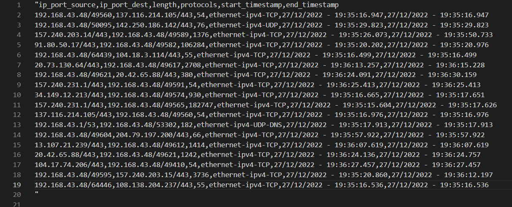

# Network analyzer (SNIFFER)

The project aims at building a multiplatform application capable of intercepting incoming and outgoing traffic through the network interfaces of a computer. The application will set the network adapter in promiscuous mode, collect IP address, port and protocol type of observed traffic and will generate a textual report describing a synthesis of the observed events. 
Such a report should list for each of the network address/port pairs that have been observed, the protocols that was transported, the cumulated number of bytes transmitted, the timestamp of the first and last occurrence of information exchange. 
Command line parameters will be used to specify the network adapter to be inspected, the output file to be generated, the interval after which a new report is to be generated, or a possible filter to apply to captured data.
The system has been developed using third party libraries (libpcap) in order to support deployment on several platforms.

The system  designed consists of a multi-platform library that supports network data capturing and recording, and a sample application that gives access to it.
The library has been properly documented, and provide a clear definition of its intended usage, as well as of any error condition that can be reported.
By using the sample application, the user is able to:
* define the network adapter to be sniffed
select a time interval after which an updated version of the report will be generated
* temporarily pause and subsequently resume the sniffing process
* define the file that will contain the report

### Report example:

## Usage

The application can be run through

 `cargo run [OPTIONS] <nic_id> <file_name> <time_interval>`

  inside the **NetworkAnalyzer_Binary** folder
  

**ARGS**:

    <nic_id>           The target network interface card to be user
    
    <file_name>        The output file where a complete report should be provided
    
    <time_interval>    Define the time interval after wihich the report is updated

The options are used to select `filters` of the capture

**OPTIONS**:

    -a, --ip_filter_source <ip_address_source>
            Keep only data that contains selected ip_address as source (ip address should have
            xxx.xxx.xxx.xxx format). Example of available ip address to filter:
                172.22.32.37

    -b, --ip_filter_dest <ip_address_destination>
            Keep only data that contains selected ip_address as destination (ip address should have
            xxx.xxx.xxx.xxx format). Example of available ip address to filter:
                172.22.32.37

    -c, --port_filter_source <port_source>
            Keep only data that contains selected port as source.
            MUST BE A NUMBER!

    -d, --port_filter_dest <port_destination>
            Keep only data that contains selected port as destination.
            MUST BE A NUMBER!

    -e, --byte_threshold <Threshold>
            Drop all the data with cumulative number of bytes below the inserted threshold.
            MUST BE A NUMBER!

    -f, --protocol_filter <Protocol name>
            Keep only data that contains selected protocol

    -h, --help
            Print help information

    -l, --list

## Documentation

The documenation can be opened running the command:

 `cargo doc --open`

 inside the **NetworkAnalyzer_Library** folder
